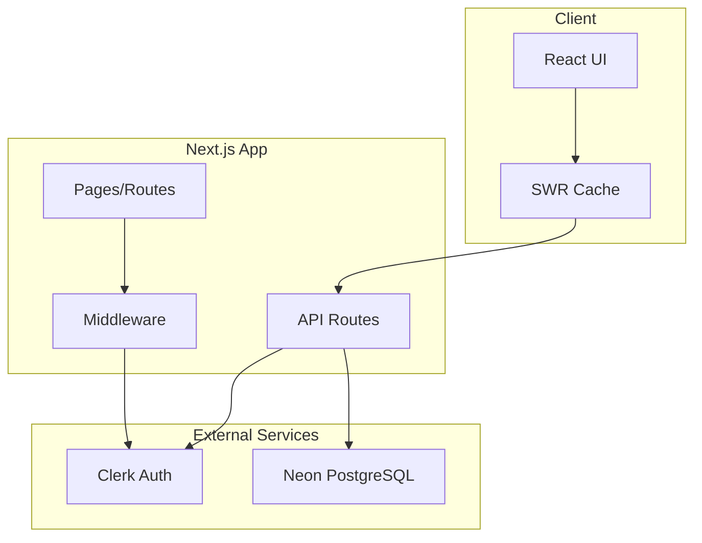

# 🏗️ System Architecture

## Overview



## Core Architecture Decisions

### 1. **Monorepo Structure**
```
habit-wellness-app/
├── apps/
│   ├── web/          # Next.js web app
│   └── mobile/       # Future: React Native
├── packages/
│   ├── ui/          # Future: Shared components
│   └── core/        # Future: Business logic
```

**Why**: Enables code sharing when adding mobile app

### 2. **Database Schema**
```sql
-- Optimized for user-scoped queries
User (1) ──< (∞) Habit (1) ──< (∞) HabitEntry

-- Indexes for performance
CREATE INDEX idx_habits_user_active ON habits(userId, isActive);
CREATE INDEX idx_entries_habit_date ON habit_entries(habitId, date);
```

**Why**: Efficient queries for user's habits and streak calculations

### 3. **Authentication Flow**
```
1. User visits protected route
2. Middleware checks Clerk session
3. API routes call getOrCreateUser()
4. User record created if needed (webhook backup)
```

**Why**: Seamless user experience, no manual registration needed

### 4. **API Design**
```typescript
// Standardized pattern for all routes
export const METHOD = withErrorHandler(async (req) => {
  const user = await getOrCreateUser();
  // Business logic
  return successResponse(data);
});
```

**Why**: Consistent error handling, auth, logging, and rate limiting

### 5. **State Management**
- **SWR** for server state (habits data)
- **React State** for UI state (forms, modals)
- **No Redux** (not needed at this scale)

**Why**: SWR handles caching, revalidation, and optimistic updates

## Data Flow

### Creating a Habit
```
1. User fills form → 2. POST /api/habits → 3. Validate input
                                         ↓
6. UI updates ← 5. SWR revalidates ← 4. Save to DB
```

### Daily Tracking
```
1. User checks habit → 2. POST /api/habits/[id]/entries
                     ↓
                     3. Create/update today's entry
                     ↓
                     4. Calculate new streak
                     ↓
                     5. Update habit.streak
                     ↓
                     6. Return updated data
```

## Security Architecture

### API Security
- ✅ Authentication required (Clerk)
- ✅ User isolation (all queries filtered)
- ✅ Input validation (Zod schemas)
- ✅ Rate limiting (100 req/min)
- ✅ SQL injection protection (Prisma)

### Data Access Pattern
```typescript
// ALWAYS filter by userId
await prisma.habit.findMany({
  where: { 
    userId: user.id,  // Required!
    ...otherFilters
  }
});
```

## Performance Optimizations

### Current
1. **Database indexes** on frequently queried fields
2. **SWR caching** reduces API calls
3. **Turbopack** for faster dev builds
4. **API response caching** (where appropriate)

### Planned
1. **Redis caching** for streak calculations
2. **Background jobs** for streak updates
3. **CDN** for static assets
4. **Database connection pooling**

## Deployment Architecture

```
Vercel ─────────────┐
│                   │
├─ Next.js App      ├─> Neon PostgreSQL
├─ API Routes       │
├─ Edge Middleware  ├─> Clerk Auth (EU)
└─ Static Assets    │
                    └─> Upstash Redis (Future)
```

## Scaling Considerations

### Current Capacity
- ~1,000 concurrent users
- ~10,000 daily active users
- ~100,000 habits tracked

### Scale Points
1. **Database**: Add read replicas
2. **API**: Implement caching layer
3. **Webhooks**: Add queue processing
4. **Calculations**: Move to background jobs

## Error Handling Strategy

```typescript
throw new ValidationError()  // 400 - Bad input
throw new UnauthorizedError() // 401 - Not logged in
throw new NotFoundError()     // 404 - Resource missing
// All others → 500 Internal Error
```

## Monitoring & Observability

### Current
- Structured logging (development)
- Error boundaries in React
- Basic performance metrics

### Needed for Production
- APM (Sentry/Datadog)
- Real user monitoring
- Database query analysis
- Uptime monitoring

## Development Workflow

```bash
1. pnpm dev          # Start dev server
2. pnpm db:studio    # View database
3. Make changes      # Hot reload
4. pnpm test        # Run tests
5. git commit       # Version control
6. Vercel deploys   # Automatic
```

## Key Design Principles

1. **User-Scoped Everything**: Security by default
2. **Fail Fast**: Validate early, throw errors
3. **Consistent Patterns**: Same structure everywhere
4. **Progressive Enhancement**: Basic features first
5. **Type Safety**: TypeScript everywhere

## Future Architecture

### Phase 2 (Months 3-6)
- Add Redis for caching
- Implement background jobs
- Add WebSocket for real-time
- Mobile app with shared packages

### Phase 3 (Months 6-12)  
- Microservices for specific features
- GraphQL API layer
- Machine learning for insights
- Multi-region deployment