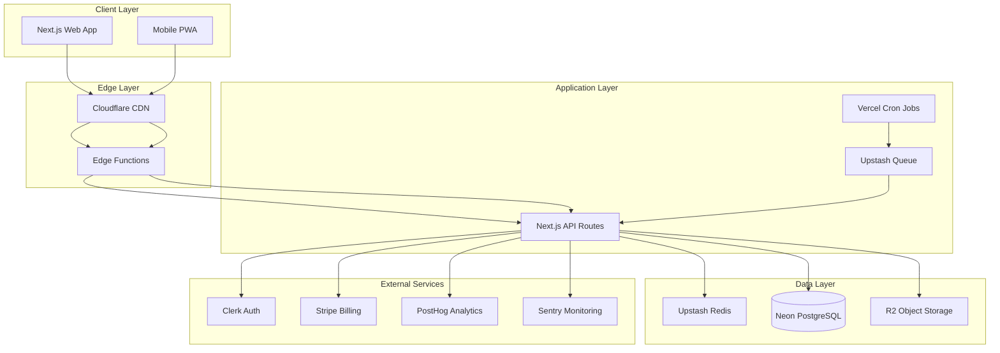
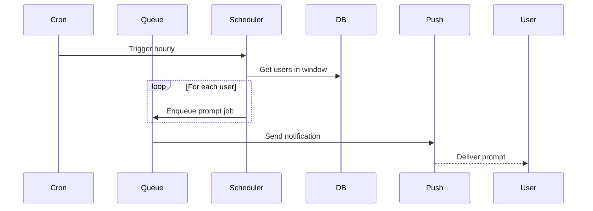
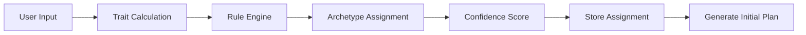
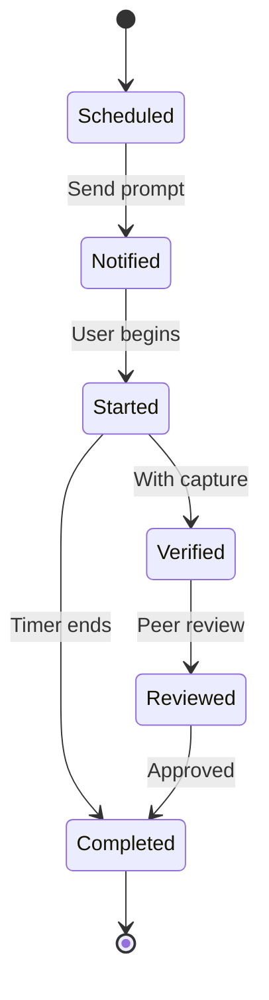
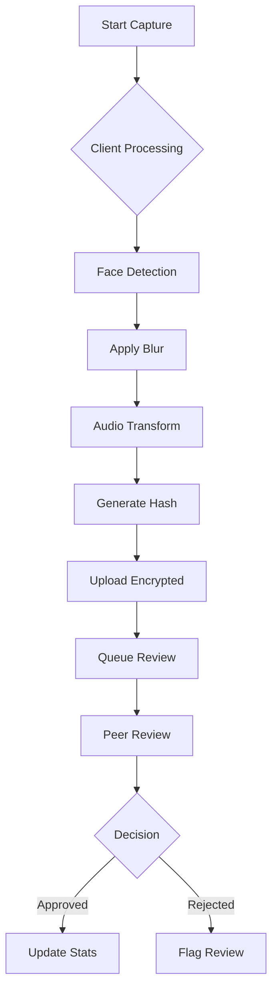
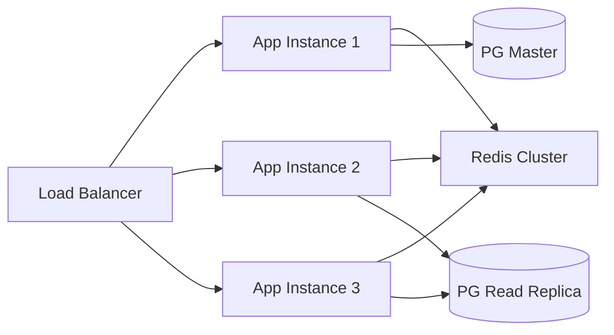
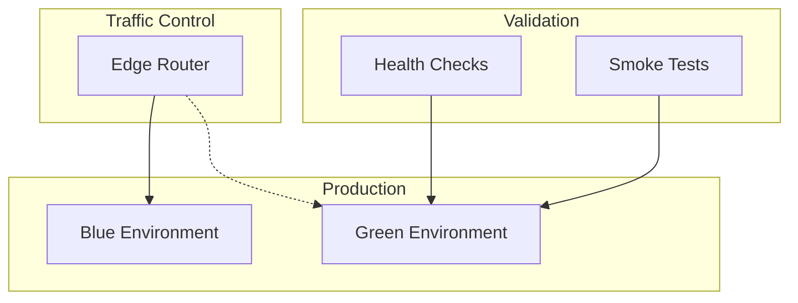

# HabitStory Architecture Documentation

## System Architecture



## Core Design Decisions

### 1. Monolithic Architecture (Strategic Choice)

We chose a monolithic Next.js application for:
- **Rapid iteration**: Single deployment unit
- **Shared code**: Components and utilities in one place
- **Simplified ops**: One service to monitor
- **Cost efficiency**: Minimal infrastructure overhead

Future microservices candidates:
- Verification processing service
- Notification delivery service
- Analytics aggregation service

### 2. Edge-First Approach

Leveraging Vercel's Edge Network:
- **Global distribution**: <50ms latency worldwide
- **Edge middleware**: Auth and rate limiting at edge
- **Static optimization**: Pre-rendered archetype content
- **Dynamic personalization**: User-specific at request time

### 3. Privacy-First Architecture

Client-side processing for sensitive data:
```typescript
// Anonymization happens in browser
const anonymized = await clientAnonymizer.process({
  video: rawStream,
  mode: 'BLUR_FACE',
  audioTransform: 'PITCH_SHIFT'
});
```

Server never sees:
- Raw biometric data
- Original video/audio
- Identifiable features

### 4. Event-Driven Scheduling



## Data Flow Architecture

### 1. Archetype Assignment Flow



### 2. Task Execution Flow



### 3. Verification Pipeline



## Database Schema Design

### Core Design Principles

1. **Normalization**: 3NF for consistency
2. **Soft Deletes**: Audit trail maintenance
3. **UUID Keys**: Distributed generation
4. **Timestamps**: Created/updated on all tables

### Key Relationships

```sql
-- Simplified view of relationships
User 1:1 Profile
User 1:N Assignment (history preserved)
User 1:N TaskInstance
User 1:N Goal
Assignment N:1 House
TaskTemplate 1:N TaskInstance
TaskInstance 1:1 VerificationSubmission
```

### Performance Indexes

```sql
-- Critical query patterns
CREATE INDEX idx_task_user_date ON task_instances(user_id, scheduled_at);
CREATE INDEX idx_active_assignment ON assignments(user_id, active);
CREATE INDEX idx_verification_status ON verifications(status, created_at);
```

## API Design Patterns

### RESTful Conventions

```
GET    /api/archetypes          # List all
GET    /api/archetypes/:id      # Get one
POST   /api/archetypes/assign   # Assign to user
GET    /api/users/me/archetype  # Current assignment
```

### Request/Response Format

```typescript
// Consistent envelope
interface ApiResponse<T> {
  data?: T;
  error?: {
    code: string;
    message: string;
    details?: any;
  };
  meta?: {
    timestamp: string;
    version: string;
  };
}
```

### Error Handling

```typescript
// Centralized error classes
class ArchetypeError extends AppError {
  constructor(message: string, code: string) {
    super('ArchetypeError', 400, message);
    this.code = code;
  }
}

// Usage
throw new ArchetypeError('Invalid trait scores', 'INVALID_TRAITS');
```

## Security Architecture

### Defense in Depth

1. **Edge Layer**
   - DDoS protection (Cloudflare)
   - Rate limiting
   - Geographic restrictions

2. **Application Layer**
   - JWT validation (Clerk)
   - RBAC authorization
   - Input sanitization
   - CSRF protection

3. **Data Layer**
   - Encryption at rest
   - Connection encryption
   - Credential rotation
   - Backup encryption

### Privacy Controls

```typescript
// Privacy middleware stack
app.use(anonymizeHeaders);
app.use(stripPII);
app.use(auditLogger);
app.use(encryptSensitive);
```

## Performance Architecture

### Caching Strategy

```typescript
// Multi-tier caching
const cacheStrategy = {
  edge: {
    // Cloudflare cache
    'static/*': '1 year',
    'api/archetypes': '1 hour'
  },
  application: {
    // Redis cache
    'user:*': 300, // 5 minutes
    'archetype:*': 3600, // 1 hour
    'prompt:*': 60 // 1 minute
  },
  database: {
    // Query cache
    statement_timeout: 5000,
    query_cache_size: '256MB'
  }
};
```

### Load Distribution



## Monitoring & Observability

### Metrics Collection

```typescript
// Key metrics tracked
const metrics = {
  // Business metrics
  'archetype.assigned': counter,
  'task.completed': counter,
  'verification.submitted': counter,
  
  // Technical metrics  
  'api.latency': histogram,
  'db.query.time': histogram,
  'cache.hit.ratio': gauge,
  
  // System metrics
  'memory.usage': gauge,
  'cpu.usage': gauge,
  'error.rate': counter
};
```

### Distributed Tracing

```typescript
// Trace context propagation
async function handleRequest(req: Request) {
  const span = tracer.startSpan('http.request');
  
  try {
    span.setAttributes({
      'http.method': req.method,
      'http.url': req.url,
      'user.id': req.user?.id
    });
    
    const result = await processRequest(req);
    span.setStatus({ code: SpanStatusCode.OK });
    return result;
    
  } catch (error) {
    span.recordException(error);
    span.setStatus({ code: SpanStatusCode.ERROR });
    throw error;
    
  } finally {
    span.end();
  }
}
```

## Deployment Architecture

### Blue-Green Deployment



### Rollback Strategy

1. **Instant rollback**: Route traffic back to blue
2. **Database migrations**: Forward-only, backward-compatible
3. **Feature flags**: Disable without deployment
4. **Canary releases**: Gradual rollout to subset

## Scaling Architecture

### Horizontal Scaling Triggers

```yaml
scaling:
  metrics:
    - type: cpu
      target: 70
    - type: memory
      target: 80
    - type: requests_per_second
      target: 1000
  
  min_instances: 2
  max_instances: 20
  scale_up_rate: 2x
  scale_down_rate: 0.5x
```

### Data Partitioning Strategy

```sql
-- Partition by user_id for even distribution
CREATE TABLE task_instances (
  id UUID,
  user_id UUID,
  -- ... other fields
) PARTITION BY HASH (user_id);

-- Time-based partitions for analytics
CREATE TABLE analytics_events (
  timestamp TIMESTAMPTZ,
  -- ... other fields  
) PARTITION BY RANGE (timestamp);
```

## Future Architecture Evolution

### Phase 1: Current Monolith
- All features in Next.js
- Single database
- Basic caching

### Phase 2: Service Extraction
- Verification service (Python/ML)
- Notification service (Go)
- Analytics pipeline (Spark)

### Phase 3: Full Microservices
- API Gateway
- Service mesh
- Event streaming (Kafka)
- CQRS for read/write split

---

This architecture is designed to scale from 0 to 1M users while maintaining <200ms response times and 99.9% availability.