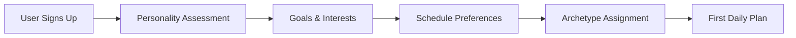
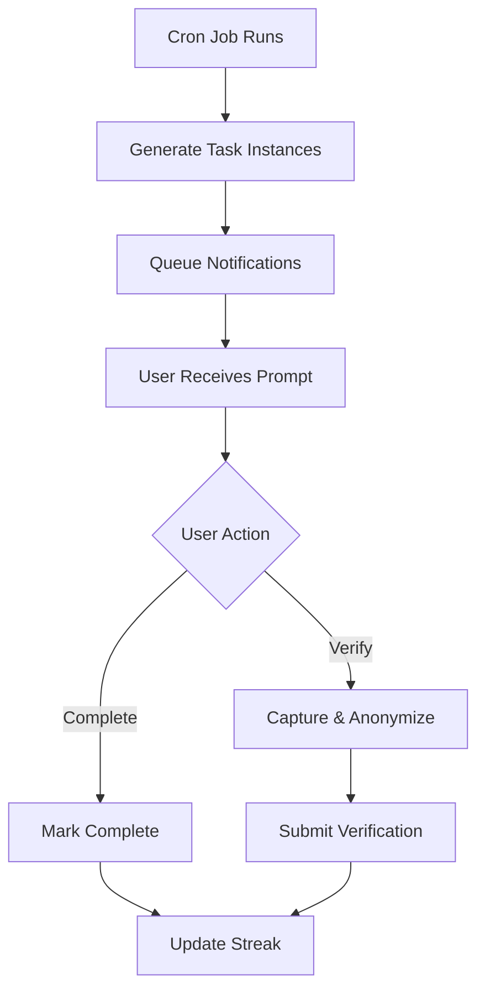
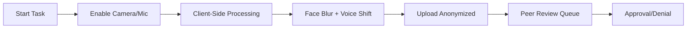

# HabitStory - Personalized Wellness Through Archetypes 🏛️

[](https://nextjs.org/)
[](https://www.typescriptlang.org/)
[](https://www.prisma.io/)
[](LICENSE)

> Transform your wellness journey through personalized archetypes, intelligent prompting, and privacy-first accountability.

## 🎯 What is HabitStory?

HabitStory revolutionizes personal wellness by:
- **Classifying users** into RPG-style archetypes (Monk, Warrior-Monk, Sage, etc.)
- **Delivering personalized prompts** based on personality, goals, and schedule
- **Providing privacy-first verification** through anonymized recordings
- **Building communities** around shared wellness identities

### 🏛️ Core Archetypes

- **🧘 Monk**: Calm clarity through Vipassana and breathwork
- **⚔️ Warrior-Monk**: Discipline through movement and meditation
- **📚 Sage**: Wisdom through reflection and visualization
- **🎨 Artisan**: Creativity through mindful practice
- **🕵️ Operative**: Focus through precision and routine
- **👥 Councilor**: Leadership through strategic clarity

## 🚀 Quick Start

### Prerequisites

- Node.js 18+ and pnpm
- PostgreSQL (via Neon or local)
- Clerk account for authentication
- Upstash Redis account (for caching/queues)

### Installation

```bash
# Clone the repository
git clone https://github.com/your-org/habitstory.git
cd habitstory

# Install dependencies
pnpm install

# Set up environment variables
cp apps/web/.env.example apps/web/.env.local
# Edit .env.local with your credentials

# Set up database
cd apps/web
pnpm db:push
pnpm db:generate

# Run development server
pnpm dev
```

Visit `http://localhost:3000` to see your app!

## 🏗️ Architecture

### Tech Stack

- **Frontend**: Next.js 15 (App Router) + React 19 + TailwindCSS v4
- **Backend**: Next.js API Routes + tRPC (optional)
- **Database**: PostgreSQL (Neon) + Prisma ORM
- **Auth**: Clerk (Google & Email)
- **Caching**: Upstash Redis
- **Queues**: Upstash Queue + Vercel Cron
- **Analytics**: PostHog
- **Monitoring**: Sentry + Custom SLIs
- **UI**: shadcn/ui components

### Key Features

#### 🎭 Archetype System
- Personality assessment (Big Five/HEXACO)
- Interest and goal mapping
- Dynamic classification algorithm
- Weekly reassessment options

#### ⏰ Intelligent Prompting
- Personalized scheduling based on user preferences
- Archetype-specific content and timing
- Push/web notifications with smart retry
- Snooze and reschedule capabilities

#### 🔐 Privacy-First Verification
- Client-side video/audio anonymization
- Pose-only capture options
- Peer review system (paid tiers)
- Blockchain-style hash verification

#### 📊 Advanced Analytics
- Streak tracking and predictions
- Archetype performance insights
- Community comparisons
- Personal growth metrics

## 📁 Project Structure

```
habitstory/
├── apps/
│   └── web/                    # Next.js application
│       ├── src/
│       │   ├── app/           # App router pages
│       │   ├── components/    # React components
│       │   │   ├── ui/       # Base UI components
│       │   │   ├── archetypes/ # Archetype-specific
│       │   │   └── verification/ # Capture widgets
│       │   ├── lib/          # Utilities
│       │   │   ├── archetype/ # Classification engine
│       │   │   ├── scheduler/ # Prompt scheduling
│       │   │   └── verification/ # Anonymization
│       │   └── hooks/        # React hooks
│       ├── prisma/           # Database schema
│       └── public/           # Static assets
├── packages/                 # Shared packages (future)
└── docs/                    # Documentation
```

## 🔑 Key Flows

### 1. Onboarding & Classification



### 2. Daily Prompt Cycle



### 3. Verification Flow



## 🛠️ Development

### Commands

```bash
# Development
pnpm dev              # Start dev server
pnpm build           # Build for production
pnpm test            # Run tests
pnpm test:e2e        # Run E2E tests
pnpm lint            # Lint code

# Database
pnpm db:push         # Push schema changes
pnpm db:generate     # Generate Prisma client
pnpm db:studio       # Open Prisma Studio
pnpm migrate:up      # Run migrations
pnpm migrate:down    # Rollback migrations

# Monitoring
pnpm diagnostics     # Run system diagnostics
pnpm test:a11y       # Test accessibility
```

### Environment Variables

```env
# Database
DATABASE_URL=postgresql://...

# Authentication
NEXT_PUBLIC_CLERK_PUBLISHABLE_KEY=pk_...
CLERK_SECRET_KEY=sk_...
CLERK_WEBHOOK_SECRET=whsec_...

# Redis (Caching & Queues)
UPSTASH_REDIS_REST_URL=https://...
UPSTASH_REDIS_REST_TOKEN=...

# Analytics & Monitoring
NEXT_PUBLIC_POSTHOG_KEY=phc_...
NEXT_PUBLIC_SENTRY_DSN=https://...

# Verification Storage
VERIFICATION_BUCKET_URL=...
VERIFICATION_SIGNING_KEY=...
```

## 🚢 Deployment

### Vercel (Recommended)

1. Connect your GitHub repository
2. Set environment variables
3. Deploy with one click

### Manual Deployment

```bash
# Build the application
pnpm build

# Run production server
pnpm start
```

## 📊 Monitoring & Analytics

### Key Metrics

- **D1 Activation**: Target ≥ 60%
- **W1 Retention**: Target ≥ 35%
- **Verification Opt-in**: Target ≥ 25% (Pro users)
- **7-Day Streak**: Target ≥ 20% of active users

### SLI/SLO Targets

- **Availability**: 99.9%
- **Latency P95**: < 500ms
- **Error Rate**: < 0.1%
- **Prompt Delivery**: 99% within 1 minute

## 💰 Monetization

### Pricing Tiers

#### Free Tier
- Core archetype assignment
- Daily prompts
- Basic streak tracking
- Community access

#### Pro ($9.99/mo)
- Anonymized verification
- Advanced analytics
- Archetype quests
- Mentor office hours

#### Pro+ ($19.99/mo)
- All Pro features
- Accountability stakes
- Custom programs
- Priority support

## 🔒 Security & Privacy

- **GDPR Compliant**: Full data control and export
- **Client-Side Anonymization**: No raw biometric data stored
- **Encryption**: At rest and in transit
- **Minimal Data Retention**: 24h for raw, 90d for metrics
- **SOC 2 Ready**: Audit trails and access controls

## 🧪 Testing

```bash
# Unit tests
pnpm test

# Integration tests
pnpm test:integration

# E2E tests
pnpm test:e2e

# Accessibility audit
pnpm test:a11y

# Performance testing
pnpm test:perf
```

## 📚 API Documentation

Full API documentation available at `/api-docs` when running locally.

Key endpoints:
- `POST /api/onboarding/submit` - Complete onboarding
- `GET /api/archetype/current` - Get user's archetype
- `GET /api/prompts/today` - Get today's tasks
- `POST /api/task/:id/complete` - Mark task complete
- `POST /api/verify/:taskId` - Submit verification

## 🤝 Contributing

See [CONTRIBUTING.md](CONTRIBUTING.md) for development guidelines.

## 📄 License

MIT License - see [LICENSE](LICENSE) for details.

## 🚀 Roadmap

### Phase 1 (Current)
- ✅ Core archetype system
- ✅ Daily prompting
- ✅ Basic verification
- 🔄 Community features

### Phase 2
- [ ] AI-generated visualizations
- [ ] Voice-guided sessions
- [ ] Advanced peer review
- [ ] Corporate wellness

### Phase 3
- [ ] Wearable integration
- [ ] Archetype evolution
- [ ] Global challenges
- [ ] Wellness marketplace

---

Built with ❤️ by the HabitStory team. Join your archetype today!