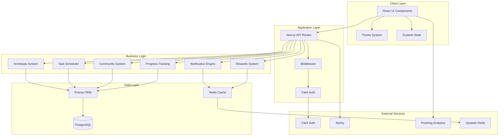
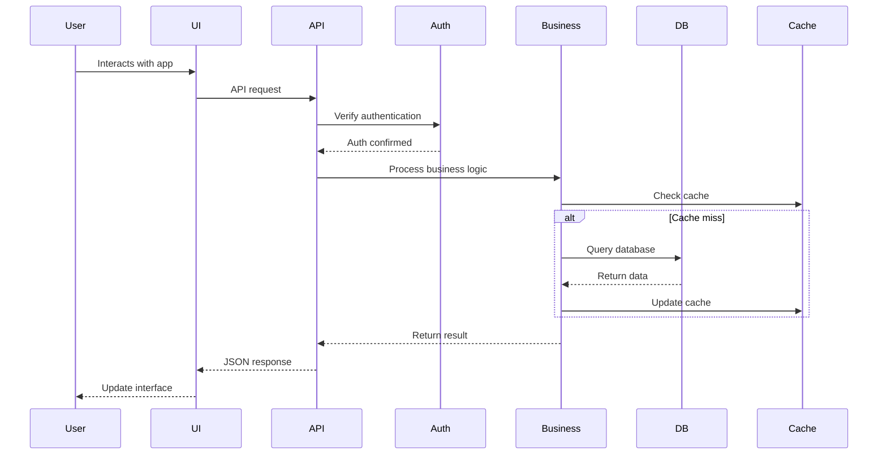
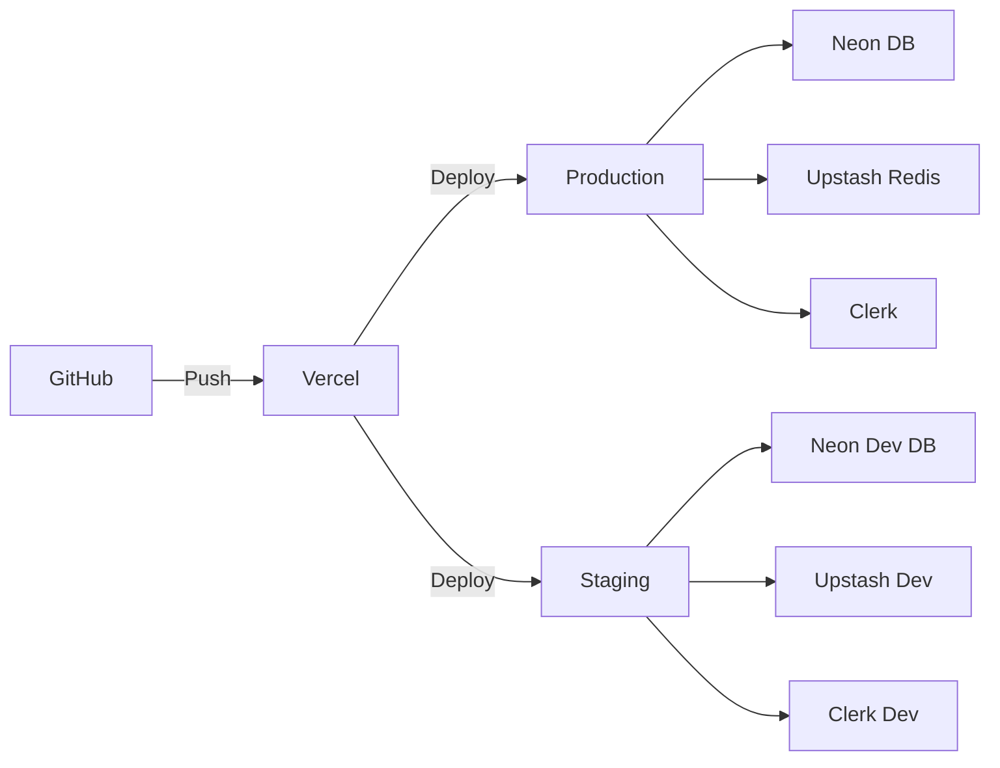

# HabitStory Architecture

## Overview

HabitStory is a personalized wellness application built with Next.js 15 (App Router) that gamifies habit formation through an archetype-based RPG system. The application uses AI-accelerated development practices with a focus on engagement mechanics.

## System Architecture

## Core Modules

### 1. Authentication & Authorization (`/lib/auth`)
- **Purpose**: User authentication via Clerk, role-based permissions
- **Key Components**:
  - `middleware.ts`: Route protection
  - `permissions.ts`: RBAC implementation
- **Dependencies**: Clerk SDK

### 2. Archetype System (`/lib/archetype`)
- **Purpose**: Personality-based user classification into Houses and Classes
- **Key Components**:
  - `classifier.ts`: Classification algorithm
  - `config.json`: House/Class definitions
  - `types.ts`: TypeScript interfaces
- **Dependencies**: None (pure business logic)

### 3. Task Scheduling (`/lib/scheduler`)
- **Purpose**: Generate personalized tasks based on archetype
- **Key Components**:
  - `task-scheduler.ts`: Task generation logic
  - Cron job integration for daily scheduling
- **Dependencies**: Prisma, date-fns

### 4. Notification System (`/lib/notifications`)
- **Purpose**: Context-aware smart notifications
- **Key Components**:
  - `smart-engine.ts`: Notification orchestration
  - `templates.ts`: Message templates
  - `types.ts`: Notification types
- **Dependencies**: Redis for cooldowns

### 5. Variable Rewards (`/lib/rewards`)
- **Purpose**: Intermittent reinforcement system
- **Key Components**:
  - `variable-rewards.ts`: Reward generation engine
  - Rarity tiers and probability calculations
- **Dependencies**: Redis for tracking

### 6. Community System (`/lib/communities`)
- **Purpose**: 12-person cohort management
- **Key Components**:
  - `house-cohorts.ts`: Cohort assignment and management
  - Real-time messaging capabilities
- **Dependencies**: Prisma for persistence

### 7. Progress Visualization (`/lib/progress`)
- **Purpose**: Skill trees and journey mapping
- **Key Components**:
  - `skill-tree.ts`: Skill progression system
  - Visual components for rendering
- **Dependencies**: Prisma for progress tracking

## Data Flow

## Technology Stack

### Frontend
- **Framework**: Next.js 15 (App Router)
- **UI Library**: React 19
- **State Management**: Zustand
- **Styling**: TailwindCSS v4 + CSS Variables
- **Components**: Radix UI + shadcn/ui patterns
- **Animations**: Framer Motion

### Backend
- **Runtime**: Node.js + Next.js API Routes
- **Database**: PostgreSQL (Neon)
- **ORM**: Prisma
- **Caching**: Upstash Redis
- **Authentication**: Clerk

### Infrastructure
- **Hosting**: Vercel
- **Monitoring**: Sentry + PostHog
- **CI/CD**: GitHub Actions
- **Development**: Turborepo monorepo

## Key Design Decisions

### 1. Monorepo Structure
- **Rationale**: Future scalability for multiple apps/packages
- **Trade-off**: Initial complexity for single app

### 2. App Router (Next.js 15)
- **Rationale**: Latest React patterns, better performance
- **Trade-off**: Less ecosystem maturity

### 3. Archetype-Based System
- **Rationale**: Unique differentiation, personalization at scale
- **Trade-off**: Complex initial setup

### 4. AI-Accelerated Development
- **Rationale**: Rapid prototyping and iteration
- **Trade-off**: Code consistency challenges

## Security Considerations

1. **Authentication**: All routes protected via Clerk middleware
2. **Authorization**: RBAC with ownership checks
3. **Data Validation**: Zod schemas on all inputs
4. **Rate Limiting**: Redis-backed rate limits
5. **Security Headers**: CSP and secure defaults

## Performance Optimizations

1. **Caching Strategy**:
   - Redis for hot data (habits, user profiles)
   - Next.js route caching
   - SWR for client-side caching

2. **Database Optimization**:
   - Indexed queries
   - Connection pooling
   - Query optimization

3. **Frontend Performance**:
   - Code splitting
   - Lazy loading
   - Image optimization

## Deployment Architecture

## Future Considerations

1. **Scaling**: Consider moving to dedicated API service
2. **Real-time**: WebSocket support for live features
3. **Mobile**: React Native app sharing business logic
4. **AI Integration**: LLM-powered coaching features
5. **Internationalization**: Multi-language support